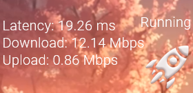

# SpeedMalistic
> A Minimalistic speed test skin for Rainmeter.

![PowerShell][PowerShell]
[![Rainmeter][Rainmeter]][RainmeterV]
[![Ookla][Ookla-img]][Ookla-url]

This is a [Rainmeter](https://www.rainmeter.net/) skin to easily test 
the speed of your internet using SpeedtestCLI by Ookla. It should give the same results as https://www.speedtest.net/

## Installation

Windows:

Download and Install rainmeter from https://www.rainmeter.net/

Save/move the folder to "C:\Users\YourName\Documents\Rainmeter\Skins" or donwload the [Release .rmskin](https://github.com/thankarezos/SpeedMalistic/releases) (suggested) and run it.

## Usage example

Click the "Rocket" icon to run the test and wait for "Running" message to dissapear for the results.

*Refreshing the skin removes the "Running" state in case a crash stoped the test midway, also resets the values to 0.

## Release History

* 0.7.1
	* Minor changes on speed data files and anti-crash protecion.
* 0.6.0
    * Released

## Meta

thankarezos  – thankarezos@gmail.com

<!-- Markdown link & img dfn's -->
[PowerShell]: https://img.shields.io/badge/PowerShell-Windows-blue
[Rainmeter]: https://img.shields.io/badge/Rainmeter-4.3.1-orange
[RainmeterV]: https://www.rainmeter.net/
[Ookla-img]: https://img.shields.io/badge/SpeedestCli-Ookla-lightgrey
[Ookla-url]: https://www.speedtest.net/apps/cli
